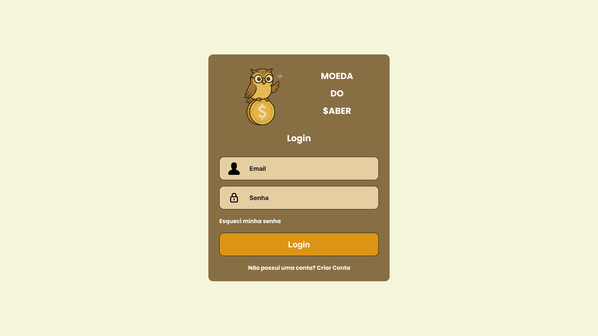
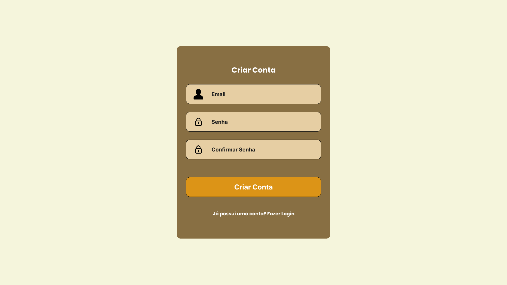
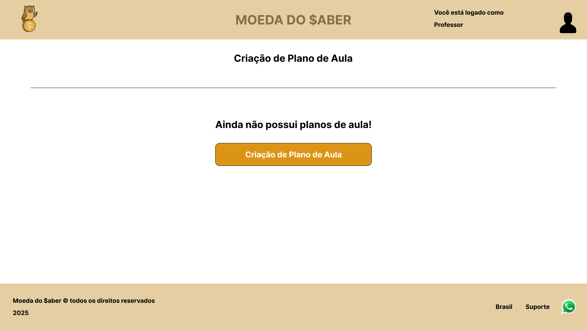
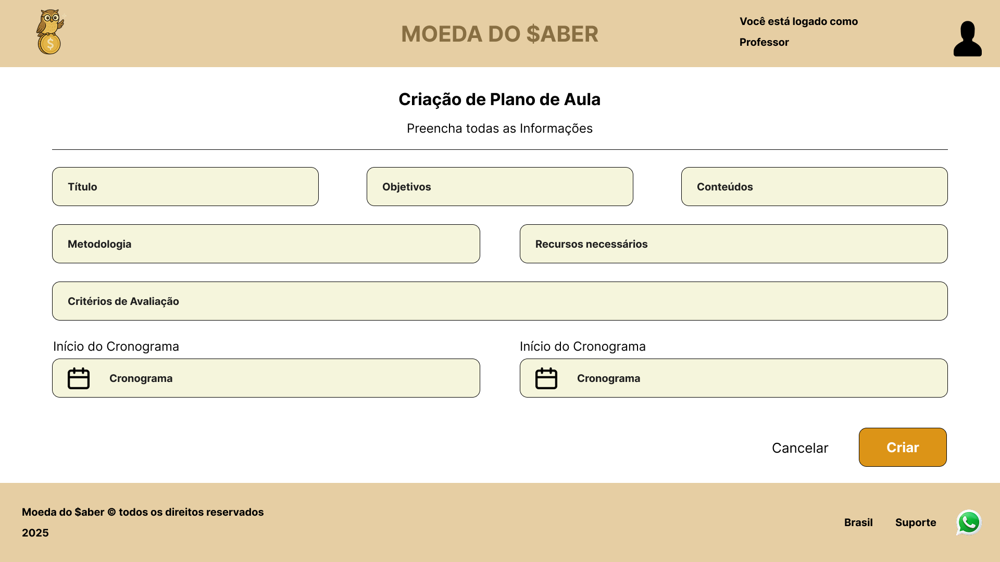
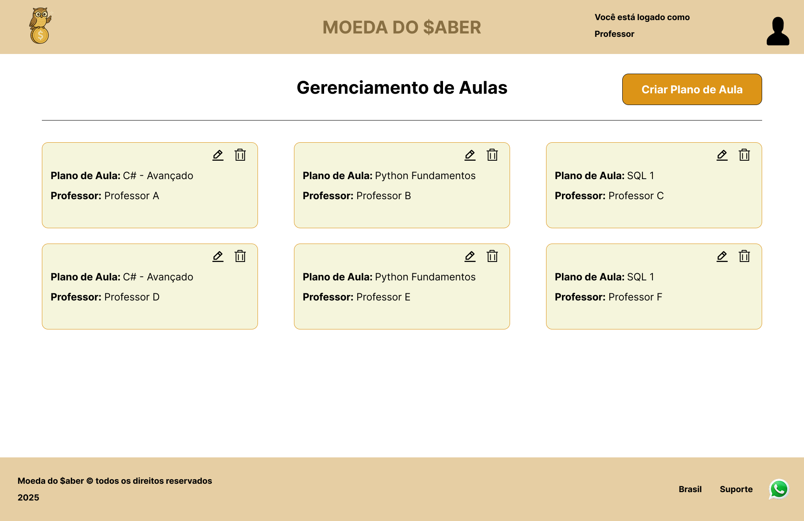

# Moeda do $aber

## Acesse nosso projeto no Figma [AQUI](https://www.figma.com/design/jNSQsr5dvKEtLoyroQcsGW/Moeda-do-Saber?node-id=0-1&t=T8CuNvRCV9i2Nl0Y-1)

## Contribuições da Equipe

- **GABRIEL MATSUZAKI** – Banco de Dados em SQL Server  
- **KAIO HENRIQUE POSTAL DE ALMEIDA** – API em PHP com Laravel  
- **RHAYSSAM HAMZE VITTI** – Telas, Design, UX UI, Figma
- **EDUARDO MENDES ALBUQUERQUE** – Front-End com HTML5, CSS3 e JavaScript e vídeo
-  **DAYANE CRISTINE MIRANDA DE MEIRELES** – Front-End com HTML5, CSS3 e JavaScript e trabalho escrito 
- **RODRIGO HENRIQUE CORDEIRO** – Team Lead, trabalho escrito e code review  

## Telas

### 1 - Tela de Login

### 2 - Tela de Registro

### 3 - Tela de Gerenciamento (Sem Dados)

### 4 - Tela de Criação de Plano de Aula

### 5 - Tela de Gerenciamento (Com Dados)

